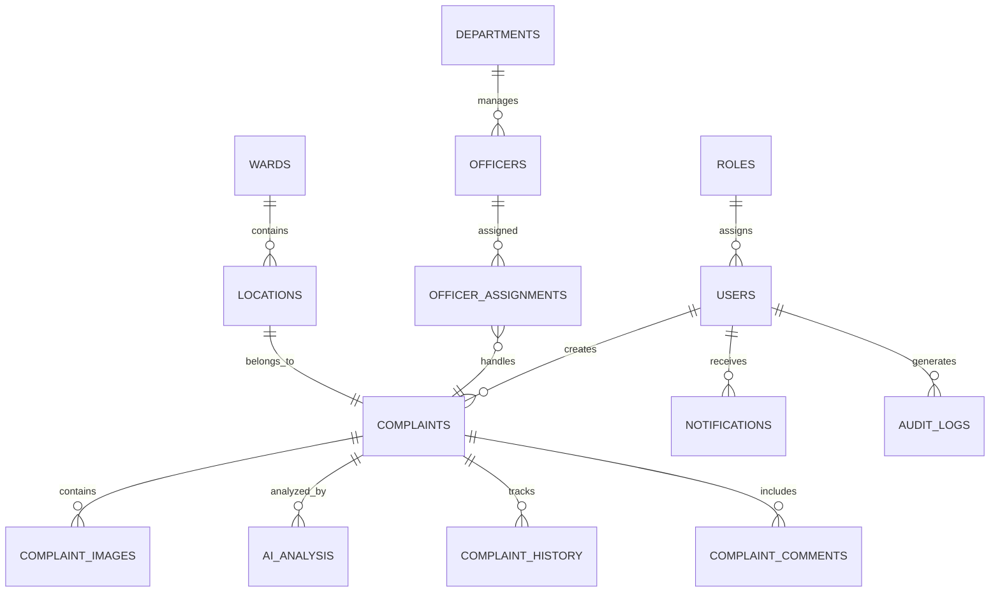

# 🗄️ DATABASE.md

# NagrikSeva Database Design Documentation

> **Version:** 1.0  
> **Database:** PostgreSQL 16 + PostGIS 3.x  
> **Caching:** Redis  
> **Architecture:** Relational Database with Spatial Intelligence  
> **Status:** Approved

---

# 1. Purpose

The database is the backbone of the NagrikSeva platform. It is designed to support:

- High-volume complaint management
- AI-powered complaint analysis
- GIS-based location intelligence
- Secure authentication
- Officer workflow management
- Real-time analytics
- Future Smart City integrations

The schema follows **Third Normal Form (3NF)** to minimize redundancy while ensuring scalability and maintainability.

---

# 2. Database Design Philosophy

The database follows the following principles:

- Single Responsibility per table
- Strong relational integrity
- Spatial data support using PostGIS
- AI-ready schema
- Auditability
- High performance
- Cloud deployment compatibility
- Future microservice migration support

---

# 3. Why PostgreSQL?

PostgreSQL was selected because it offers:

- ACID compliance
- Excellent relational capabilities
- Native JSON support
- High scalability
- Mature ecosystem
- Enterprise-grade reliability
- Compatibility with PostGIS

---

# 4. Why PostGIS?

NagrikSeva is fundamentally a location-driven application.

PostGIS enables:

- Radius-based complaint search
- Ward detection
- Heatmap generation
- Spatial clustering
- Geo-fencing
- Reverse geospatial queries
- Future route optimization

Without PostGIS, these features would require expensive custom implementations.

---

# 5. Why Redis?

Redis is used for:

- JWT blacklist
- Session caching
- Frequently accessed complaint data
- Rate limiting
- Notification queues
- API response caching

Redis significantly reduces database load while improving response time.

---

# 6. Database Architecture

```text
Flutter App
      │
      ▼
 NestJS Backend
      │
      ▼
 PostgreSQL + PostGIS
      │
      ├──────────────► Redis Cache
      │
      ▼
 AI Microservice
```

---

# 7. Domain Model

The system is divided into logical domains.

## Authentication

- Users
- Roles
- Sessions
- Refresh Tokens

---

## Complaint Management

- Complaints
- Complaint Images
- Complaint Comments
- Complaint History
- Complaint Status Logs

---

## AI

- AI Analysis
- Duplicate Clusters
- Image Metadata

---

## Administration

- Departments
- Officers
- Officer Assignments

---

## GIS

- Locations
- Wards

---

## Communication

- Notifications
- Notification Preferences

---

## Monitoring

- Audit Logs
- System Logs

---

# 8. High-Level Entity Relationship Diagram



---

# 9. Core Database Modules

The database consists of seven primary modules.

| Module | Purpose |
|----------|----------|
| Authentication | User identity and security |
| Complaint Management | Complaint lifecycle |
| AI Intelligence | AI predictions and analytics |
| Administration | Departments and officers |
| GIS | Spatial intelligence |
| Communication | Notifications |
| Monitoring | Logs and auditing |

---

# 10. Naming Conventions

## Tables

- plural
- lowercase
- snake_case

Example

```text
users
complaints
departments
```

---

## Columns

Use snake_case.

Example

```text
created_at
updated_at
phone_number
department_id
```

---

## Primary Keys

Every table uses

```text
UUID
```

Example

```sql
id UUID PRIMARY KEY
```

---

## Foreign Keys

Always use

```text
<table_name>_id
```

Example

```text
user_id

department_id

complaint_id
```

---

# 11. Common Columns

Almost every table includes

```text
id

created_at

updated_at

created_by

updated_by
```

This provides complete traceability.

---

# 12. Spatial Data Standards

Every complaint location is stored using

```sql
geometry(Point,4326)
```

instead of

```text
latitude

longitude
```

Advantages:

- Radius search
- Distance calculations
- Spatial indexing
- Heatmaps
- Polygon queries
- GIS analytics

---

# 13. UUID Strategy

Every entity uses UUID v4.

Reasons:

- Globally unique
- Secure against enumeration
- Easier microservice migration
- Offline ID generation

---

# 14. Data Integrity Rules

The database enforces:

- Foreign key constraints
- NOT NULL constraints
- UNIQUE constraints
- CHECK constraints
- Cascading updates where appropriate

Application logic must never bypass database integrity.

---

# 15. Scalability Goals

The schema is designed to support:

- 5+ million complaints
- 500,000+ registered citizens
- 50+ municipal departments
- Multiple cities
- Future multi-tenant deployment

---

# 16. Future Database Expansion

The schema has been designed to accommodate:

- Reward points
- Crowd verification
- IoT sensors
- Drone inspections
- Smart traffic systems
- Predictive maintenance
- Blockchain audit trails

without major redesign.

---

# 17. Next Section

The next document section defines every table in detail, including:

- Columns
- Data types
- Primary keys
- Foreign keys
- Constraints
- Relationships
- Indexes

This serves as the implementation blueprint for the backend.
