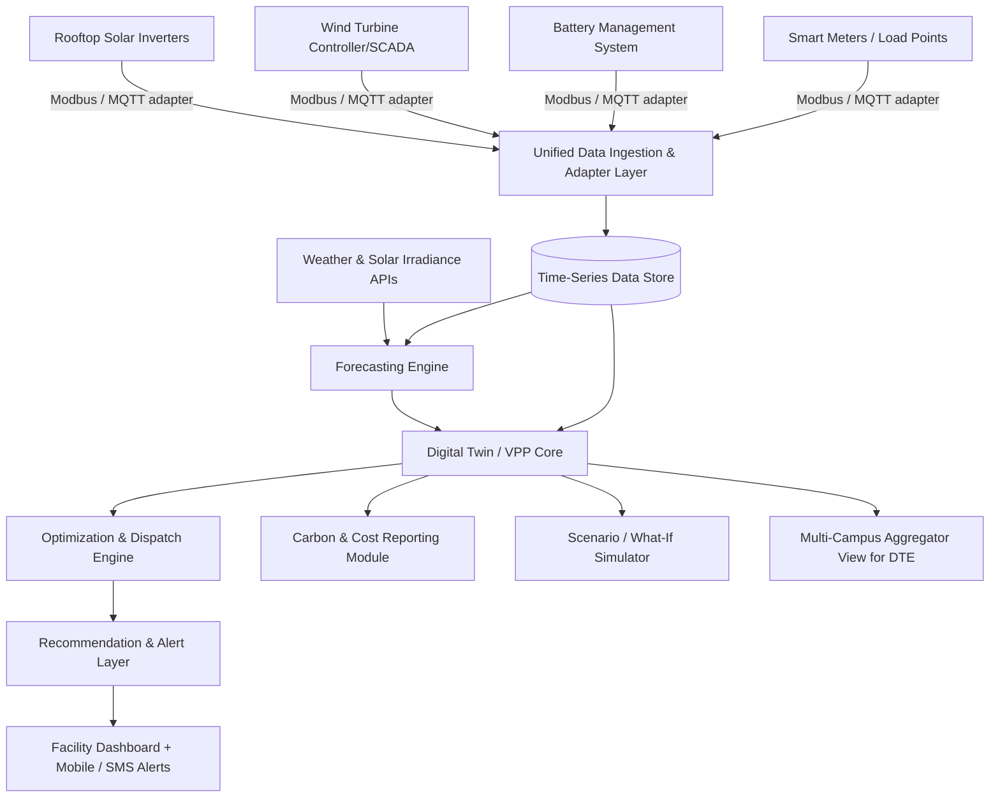

# 🔋 UrjaSetu — Campus Virtual Power Plant Orchestrator
### Complete Ideation & Execution Blueprint | SIH Problem Statement SVH26004

| Field | Detail |
|---|---|
| Problem Statement ID | SVH26004 |
| Title | Hybrid Renewable Energy Generation Solution |
| Organization | Government of Rajasthan |
| Department | Directorate of Technical Education (DTE) |
| Category | Software |
| Theme | Clean & Green Technology |

---

## 0. TL;DR — 30-Second Elevator Pitch

> "Public campuses in Rajasthan already have solar panels, wind turbines and batteries — but each runs in isolation, so surplus solar gets dumped, batteries cycle on fixed timers, and campuses still pull from the grid at the worst possible hours. **UrjaSetu** is a vendor-neutral software layer that fuses live sensor data with short-term weather forecasts to treat solar + wind + battery + grid as one coordinated **Virtual Power Plant (VPP)**. It tells facility staff — in plain language, with one click — exactly when to charge the battery, when to shift a load, and when it's safe to export, maximizing self-consumption without a single rupee of new hardware."

This is the sentence you open your pitch with. Memorize it.

---

## 1. Decoding the Real Ask (Read This Before You Design Anything)

The problem statement says it outright: **"The crux of the challenge is orchestration, not hardware procurement."** This is the single most important line in the entire document, and it is also where most teams will go wrong.

**What will get you eliminated in round 1:** any solution that spends its architecture on "which solar panel to buy" or "which turbine is best" or that proposes new hardware installation as the core deliverable. The organization already has the hardware. They want the software brain that sits on top of it.

**What will get you shortlisted:** a solution that assumes hardware heterogeneity as a *given constraint* and designs specifically for it — because that heterogeneity (different vendors, different protocols, no shared scheduling logic) is *the actual problem*, not a footnote.

Three explicit requirements buried in the text that judges will specifically check for:
1. **"Vendor-neutral"** → you must show a hardware/vendor abstraction layer, not a point solution tied to one inverter brand.
2. **"Without specialised training"** → your UX has to be usable by non-technical facilities staff, not a data-science dashboard full of jargon.
3. **"Minimal additional hardware expenditure"** → your pitch must repeatedly emphasize this is a *software-only* deployment on top of existing meters/sensors.

Repeat these three phrases almost verbatim in your pitch deck. Judges wrote the problem statement — mirroring their own language back at them (backed by a real design) is one of the highest-leverage things you can do.

---

## 2. The Big Idea

**Core concept:** Treat every campus as a miniature **Virtual Power Plant (VPP)** — the same coordination concept utilities use to aggregate thousands of rooftop solar + battery systems, applied here at single-campus scale, then made scalable across every DTE institution in the state.

### Name Options (pick one and stay consistent everywhere — deck, repo, demo)
| Name | Meaning | Vibe |
|---|---|---|
| **UrjaSetu** ⭐ recommended | "Urja" (energy) + "Setu" (bridge) — bridges solar, wind, battery, grid | Clean, memorable, easy to say to a jury |
| SAMANVAY Grid | Hindi for "coordination/harmony" | Emphasizes orchestration directly |
| VayuSurya Sync | "Wind-Sun Sync" | Literal, techy |

Go with **UrjaSetu**. It's short, meaningful in Hindi and English, and doubles as a strong domain/repo name (`urjasetu.tech`, `urjasetu-vpp`).

### One-Line Solution Statement (for your title slide)
> "UrjaSetu is a vendor-neutral, AI-driven Virtual Power Plant platform that unifies a campus's solar, wind, battery and grid connection, forecasts generation and demand, and issues real-time operational recommendations to maximize renewable self-consumption and minimize cost and carbon — with zero new hardware and zero specialized training."

---

## 3. Core USPs / What Makes This Win-Worthy

1. **Vendor-neutral adapter layer** — a translation layer (Modbus/MQTT/OPC-UA) so *any* inverter, turbine controller, BMS, or smart meter can plug in, regardless of manufacturer. This directly answers the "vendor-neutral" requirement in the problem statement.
2. **Explainable recommendations, not a black box** — every suggestion ("Charge battery now — 40% surplus solar expected next 2h") shows *why*, in plain language. This is what earns trust from non-technical staff and is a strong differentiator from typical ML dashboards that just show numbers.
3. **Digital Twin + What-If Simulator** — before a facility head commits to any action, they can simulate "what if we added 5 more panels" or "what if the workshop shifts to 2 PM" and see projected impact. Huge demo wow-factor, low implementation cost.
4. **State-wide scalability by design** — because the client is a *Directorate*, not one college, architect this from day one as a multi-tenant platform: one central dashboard where DTE can see aggregate savings/carbon across all its institutions, while each campus gets its own local view. This single design decision multiplies your perceived impact 10x in the eyes of judges.
5. **Zero-hardware-cost narrative** — reuses existing meters/inverters/sensors; the "hardware" investment is a one-time low-cost gateway device (or even a Raspberry Pi) per site if a protocol adapter is needed.
6. **Regulatory tailwind already exists (see §12)** — Rajasthan's own regulator has *just* introduced Virtual Net Metering (VNM) and Group Net Metering (GNM) rules, meaning your "virtual power plant" concept isn't just a nice metaphor — it maps onto an actual, current state policy mechanism. Almost no competing team will know this; it's a strong feasibility argument.
7. **Human-in-the-loop safety model** — recommendations are advisory by default (not autonomous control), so the system is safe to deploy without liability concerns — an important point when pitching to a government education department.

---

## 4. System Architecture

### Module Breakdown

**1. Adapter Layer (Vendor-Neutral)**
Translates proprietary protocols (Modbus RTU/TCP, MQTT, OPC-UA) from different solar/wind/battery vendors into one common data schema. This is the module that literally *is* the "vendor-neutral" answer to the problem statement — build at least one real adapter (e.g., a Modbus simulator) and document the interface for the rest, even if simulated for the demo.

**2. Time-Series Data Store**
Stores generation, consumption, weather, and battery state-of-charge (SOC) at short intervals. Use a time-series-optimized store (see tech stack) since this is fundamentally sensor-stream data.

**3. Forecasting Engine**
Two forecasts, refreshed every 15–30 min:
- **Generation forecast**: solar (irradiance + cloud cover + historical panel output) and wind (wind-speed forecast + turbine power curve).
- **Demand forecast**: short-term load forecasting from historical consumption patterns + calendar awareness (class schedules, hostel occupancy, lab hours).

**4. Digital Twin / VPP Core**
A virtual model that represents the campus's full energy state at any instant — combined generation, combined load, battery SOC, grid import/export — as **one asset**, not four separate ones. This abstraction is what lets the optimizer reason about the whole system.

**5. Optimization & Dispatch Engine**
Given forecasts + current state, decides: when to charge/discharge the battery, which loads can be shifted and to when, and whether to export or curtail. Start with a rule-based/heuristic engine for the hackathon (fast to build, easy to explain to judges), with a documented roadmap to a proper optimizer (MILP or reinforcement learning) for production.

**6. Recommendation & Alert Layer**
Converts optimizer output into plain-language, actionable messages for facility staff — this is your "no specialized training" answer.

**7. Carbon & Cost Reporting**
Auto-generated dashboards showing ₹ saved, kWh self-consumed vs grid-drawn, and CO₂ avoided — critical for a government theme like "Clean & Green Technology" and for ESG-style reporting DTE can show upward to the state government.

**8. Scenario / What-If Simulator**
Lets a facility head test "add more panels," "shift lab hours," or "add another battery" against historical data before committing budget — this is your single best live-demo feature.

**9. Multi-Campus Aggregator (DTE view)**
A rolled-up dashboard across all participating campuses — turns this from "one college's tool" into "a state asset," which is exactly the scale a Directorate cares about.

---

## 5. Feature Prioritization for the Hackathon (MoSCoW)

| Priority | Feature | Why |
|---|---|---|
| **Must** | Realistic data simulator (solar/wind/load/battery time series per campus) | No real hardware access during hackathon — you need believable demo data |
| **Must** | Live dashboard: current generation mix, battery SOC, grid draw | This is your core visual |
| **Must** | Short-term forecast (6–24h) for generation + demand | Directly requested in the problem statement |
| **Must** | Recommendation engine (battery charge/discharge windows, load-shift suggestions, export/curtail calls) | This *is* the "orchestration" the problem statement is asking for |
| **Must** | Cost & carbon savings report | Ties to "Clean & Green Technology" theme and gives judges a number to remember |
| **Should** | At least one real protocol adapter (Modbus simulator) + documented spec for others | Proves the "vendor-neutral" claim isn't just marketing |
| **Should** | What-if scenario simulator | High demo impact, moderate build effort |
| **Should** | Explainability panel ("why this recommendation") | Differentiator vs generic dashboards |
| **Should** | Multi-campus/DTE aggregate view | Scalability story |
| **Could** | Reinforcement-learning-based optimizer (vs rule-based) | Good "future roadmap" slide even if not built |
| **Could** | SMS/push alerts via a free-tier API | Nice-to-have polish |
| **Could** | Gamified nudges for hostel/lab energy behavior | Optional flavor, don't overinvest |
| **Won't (this round)** | Real hardware deployment, full cybersecurity hardening, live DISCOM billing integration | Out of scope for a hackathon prototype — mention as future work only |

---

## 6. Recommended Tech Stack

| Layer | Recommendation | Notes |
|---|---|---|
| Frontend | React (Vite) + Tailwind + Recharts/Chart.js | Fast to build, clean charts for generation/forecast curves |
| Backend/API | FastAPI (Python) | Python keeps ML and API in one language — huge speed advantage in a time-boxed hackathon |
| Real-time layer | WebSockets (FastAPI) or MQTT broker (Mosquitto, simulated) | For "live" feel in the demo |
| Database | PostgreSQL + TimescaleDB extension (or InfluxDB) | Purpose-built for time-series sensor data |
| Forecasting | Prophet or a simple gradient-boosted regressor (LightGBM/XGBoost) on historical + weather features | Prophet is fast to demo and explain; mention LSTM as a stretch/roadmap item |
| Optimization | Rule-based engine for MVP; PuLP/OR-Tools (MILP) as documented next step; RL (stable-baselines3) as long-term roadmap | Don't over-engineer the optimizer for a hackathon — a well-reasoned rule engine that judges can follow beats an opaque model they can't |
| Weather/irradiance data | Open-Meteo (free, no key) or NASA POWER; mention Solcast as a premium production option | Needed for solar/wind generation forecasting |
| Adapter/simulation | Python scripts emulating Modbus/MQTT sensor streams | Since no real hardware is available, this *is* your data source |
| Auth | Firebase Auth or simple JWT | Keep simple — this isn't the differentiator |
| Deployment | Docker Compose; host demo on Render/Railway/Vercel free tiers | Reliable and quick for a live demo link |

---

## 7. Demo Data Strategy (No Hardware Access — Plan for This Explicitly)

Since you won't have a real solar array/wind turbine wired up, **build a synthetic data generator early** — this is not a shortcut, it's core infrastructure:
- Solar profile: bell-curve output tied to time-of-day, modulated by a simulated "cloud cover" factor pulled from a real weather API for a real Rajasthan location (e.g., Bhopal/Jaipur), so the demo feels grounded in reality.
- Wind profile: power-curve model driven by simulated wind-speed time series with realistic variability.
- Load profile: typical institutional daily curve (morning ramp, midday peak from labs/HVAC, evening hostel peak) with day-of-week variation.
- Battery model: simple SOC state machine responding to charge/discharge commands from your optimizer.
- Inject occasional "surprise" events (sudden cloud cover, unexpected load spike) before the live demo — this is what makes the recommendation engine look genuinely smart when it reacts.

**Practical tip:** don't just show static graphs — have the simulator run on a fast clock (1 simulated hour = a few real seconds) so the judges *see* the system react to changing conditions in real time during your demo window.

---

## 8. Screens to Build (in priority order)

1. **Live Overview** — current generation mix (solar/wind/battery/grid), battery SOC gauge, today's forecast curve overlay.
2. **Recommendations Panel** — plain-language action cards with a one-line "why."
3. **Reports** — ₹ saved, kWh self-consumed, CO₂ avoided, trend over time.
4. **What-If Simulator** — sliders/inputs for "add panels," "shift load," instant projected-impact chart.
5. **DTE Multi-Campus View** — a state map or list showing aggregate savings across sample campuses.

---

## 9. Build Timeline

### If this is a short internal college round (24–36h)
| Phase | Hours | Focus |
|---|---|---|
| 1 | 0–4 | Finalize architecture, split roles, scaffold repos, build data simulator skeleton |
| 2 | 4–14 | Backend APIs, database schema, forecasting model v1, adapter layer stub |
| 3 | 14–22 | Recommendation engine, frontend dashboard wired to live/simulated data |
| 4 | 22–28 | What-if simulator, reports module, explainability panel |
| 5 | 28–32 | Polish UI, bug fixes, rehearse demo end-to-end |
| 6 | 32–36 | Pitch deck, demo video backup, final rehearsal |

### If you have 1–2 weeks of prep before the internal round
- **Days 1–2:** Research (see §12), finalize architecture and name/branding, wireframe UI.
- **Days 3–6:** Build data simulator + backend + forecasting model.
- **Days 7–9:** Build recommendation engine + dashboard.
- **Days 10–11:** What-if simulator + reports + adapter layer.
- **Days 12–13:** Polish, testing, deck creation.
- **Day 14:** Full dry-run pitch with feedback from your faculty mentor.

---

## 10. Suggested Team Role Split (SIH teams typically run 6 members)

1. **Team Lead / Backend & Optimization Engineer** — owns API + recommendation logic.
2. **ML/Forecasting Engineer** — generation & demand forecast models.
3. **Frontend/Dashboard Developer** — all UI screens, chart wiring.
4. **Data/Simulation Engineer** — synthetic data generator, adapter layer, weather API integration.
5. **Domain Research & Feasibility Lead** — Rajasthan energy policy research, cost/impact numbers, judges' Q&A prep.
6. **Pitch & Storytelling Lead** — deck design, demo script, video backup, presentation delivery.

Note: SIH generally requires **6 student members per team with at least one female member**, plus a faculty mentor — confirm this with your SPOC/institution rules for this cycle.

---

## 11. Pitch Deck Structure (map this to your college's SIH template)

1. **Title slide** — team name, UrjaSetu branding, problem statement ID.
2. **Problem** — restate in the judges' own language (grid dependence, isolated assets, no orchestration).
3. **Our Big Idea** — one-liner + VPP analogy, in one sentence a non-technical judge can repeat back.
4. **Architecture** — the mermaid-style diagram from §4, simplified for a slide.
5. **What Makes This Different** — your USPs from §3, especially vendor-neutrality and zero-hardware-cost.
6. **Live Demo** — dashboard walkthrough + what-if simulator (this is where you win or lose the room).
7. **Feasibility & Regulatory Fit** — cite Rajasthan's VNM/GNM regulations (§12) — shows real research depth.
8. **Impact & Numbers** — savings/carbon estimates (§13), clearly labeled as pilot-stage projections.
9. **Scalability Plan** — single campus → all DTE institutions → potential statewide rollout.
10. **Roadmap & Ask** — what you'd build next (RL optimizer, real IoT integration, DISCOM API tie-in).

**Judging criteria to keep visible while designing every slide** (commonly used across SIH internal/grand-finale rounds): **Novelty, Technical Complexity, Clarity of presentation, Feasibility of implementation, Practicability/real-world usability, and Sustainability/scalability of impact.** Explicitly address all six — don't assume the demo speaks for itself.

---

## 12. Regulatory Tailwind — Use This in Your Feasibility Slide

This is genuinely useful ammunition most competing teams won't have researched:

- Rajasthan's electricity regulator (RERC) already permits **net metering up to 500 kW** for rooftop solar consumers, with net billing for larger systems.
- In its **Third Amendment Regulations (2025)**, RERC introduced **Virtual Net Metering (VNM)** and **Group Net Metering (GNM)**, allowing distributed renewable projects (up to 1 MW) to be metered and credited as a *virtual, aggregated* asset — across government, commercial, and institutional consumer categories, aligned with Rajasthan's **Integrated Clean Energy Policy 2024**.
- This means the "Virtual Power Plant" framing of your solution isn't just a technical metaphor — it maps directly onto an *actual, current state regulatory mechanism* that DTE campuses could plug into for real financial benefit. Say this explicitly in your feasibility slide; it signals you did real domain homework, not just tech-stack assembly.

*(Always advise your team to verify the latest RERC orders directly before quoting exact tariff figures in a live pitch — regulatory numbers move.)*

---

## 13. Impact Numbers to Quote (Clearly Frame as Illustrative Estimates)

Be careful here — do not present precise numbers as verified facts. Frame everything as *"typical ranges reported in campus-scale VPP pilots, to be validated with real site data during a pilot deployment."* Suggested framing:
- Uncoordinated rooftop solar + isolated battery setups typically achieve **~55–65% self-consumption** of generated renewable energy.
- Coordinated dispatch (battery timed to true surplus/deficit, load-shifting recommendations) can realistically push that toward **~75–85%**, reducing grid dependence during peak tariff hours.
- Each percentage point of improved self-consumption on a mid-size campus translates to real, quantifiable ₹ savings and CO₂ avoided — calculate this live from your own simulator's numbers during the demo rather than quoting a canned figure; a number your dashboard *computes on stage* is far more credible than one printed on a slide.

---

## 14. Risks & Mitigations

| Risk | Mitigation |
|---|---|
| Forecast inaccuracy during monsoon/heavy cloud cover | Show confidence intervals, not point forecasts; fall back to conservative "safe mode" recommendations |
| Rural campus connectivity issues | Design for edge caching — local recommendations continue even if cloud sync drops |
| Vendor protocol lock-in | Adapter layer architecture (§4) is the explicit mitigation — mention it directly when asked |
| Data security of grid/energy data | Role-based access, encryption in transit/at rest — mention as implemented even at prototype level if feasible |
| Autonomous control causing unsafe grid action | Keep the system **advisory, human-in-the-loop** by default — a facility operator confirms critical actions (this also reduces liability concerns, which government judges will ask about) |
| Judges doubting feasibility of "zero specialized training" claim | Have your UI ready to hand to a judge and let *them* click through it live — the strongest possible proof |

---

## 15. Competitive Landscape (Know This, Mention Briefly)

Enterprise VPP/energy-management platforms (e.g., utility-scale aggregator software used internationally) exist but are expensive, built for large-scale grid operators, and require specialized operators — not designed for a resource-constrained public education campus. Your differentiation: **purpose-built for Indian public-sector campus scale, vendor-neutral, zero specialized training, and aligned with existing Rajasthan regulatory mechanisms (VNM/GNM).** Keep this comparison brief in the pitch — one slide, not a deep-dive — judges care more about your solution than about competitors.

---

## 16. Judges' Q&A — Prepare Answers in Advance

- **"How does this scale to 50 campuses without 50 separate deployments?"** → Multi-tenant architecture, one adapter spec, centralized DTE aggregator view (§4, module 9).
- **"What happens without internet connectivity?"** → Local edge fallback with cached rules; sync resumes when connectivity returns.
- **"Why should a facility manager trust an AI recommendation?"** → Explainability panel (§3) + advisory-only, human-confirmed actions (§14).
- **"What's the actual cost to deploy this at a real campus?"** → Software-only deployment on existing meters/inverters; only new cost is a low-cost gateway device per site if a legacy device lacks a digital interface.
- **"How is this different from just buying a bigger battery?"** → Bigger batteries without coordination logic still cycle on fixed schedules and miss real surplus/deficit windows — this is the "orchestration, not procurement" argument from the problem statement itself.

---

## 17. Immediate Next Steps Checklist

- [ ] Confirm team roster (6 members, ≥1 female member per SIH norms) and faculty mentor assignment with your SPOC.
- [ ] Lock the name (**UrjaSetu**) and set up repo, deck template, and shared drive.
- [ ] Assign roles per §10 today — don't wait for the hackathon to start.
- [ ] Build the data simulator first — everything else depends on it.
- [ ] Draft the pitch deck skeleton (§11) in parallel with development, not after.
- [ ] Do at least one full dry-run demo + Q&A rehearsal before the actual round.
- [ ] Verify current RERC tariff/VNM-GNM figures directly before quoting exact numbers live.

---

## Sources & Further Reading
- SIH 2026 idea evaluation criteria & format: unstop.com, thenewviews.com (SIH FAQs & PPT template guides)
- Rajasthan RERC net metering / Virtual & Group Net Metering (Third Amendment 2025): yellowhaze.com, energymart.in, reconnectenergy.com
- Rajasthan rooftop solar tariff revisions: solarquarter.com, bluebirdsolar.com

*Good luck — you already understand the real problem better than most teams will. Build the orchestration layer, keep the UI dead simple, and let your simulator do the talking on demo day.*
